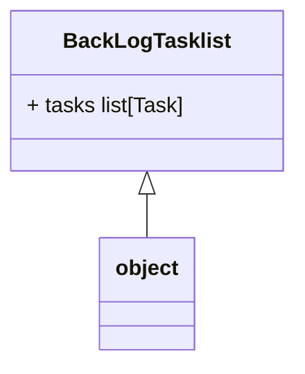
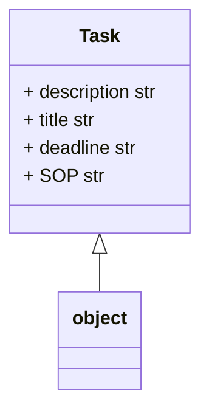
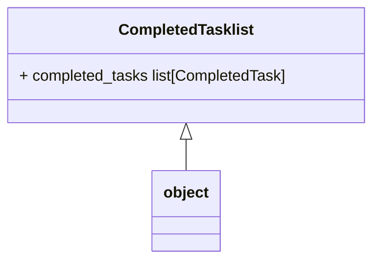
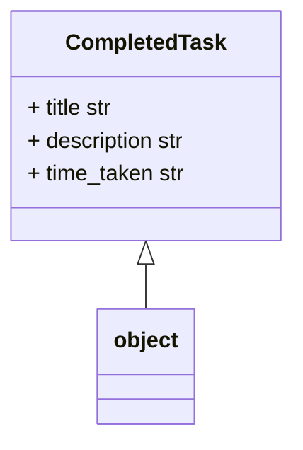

```mermaid
classDiagram
BackLogTasklist <|-- object
BackLogTasklist : + tasks list[Task]
```

```mermaid
classDiagram
   Task <|-- object
   Task : + description str
   Task : + title str
   Task : + deadline str
   Task : + SOP str
```

```mermaid
classDiagram
   CompletedTasklist <|-- object
   CompletedTasklist : + completed_tasks list[CompletedTask]
```

```mermaid
classDiagram
   CompletedTask <|-- object
   CompletedTask : + title str
   CompletedTask : + description str
   CompletedTask : + time_taken str
```
